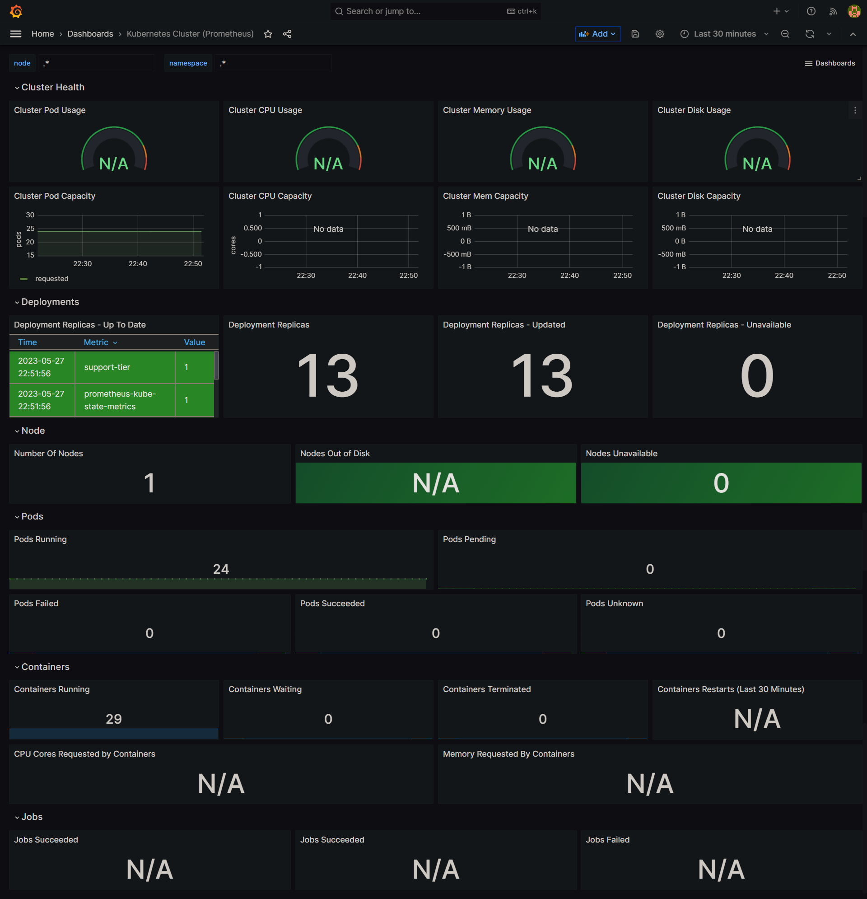

# a433-microservices
Repository ini digunakan untuk kebutuhan kelas Belajar Membangun Arsitektur Microservices

## Deploying Prometheus and Grafana
Refers to [this](https://k21academy.com/docker-kubernetes/prometheus-grafana-monitoring/) tutorial.

